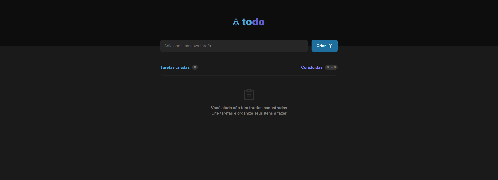
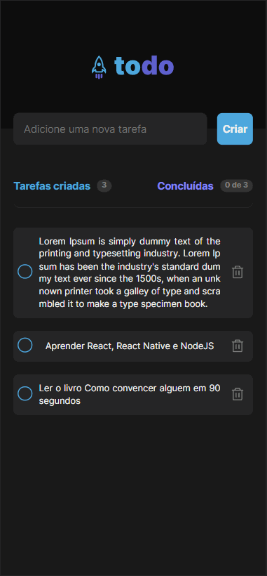

<h1 align="center">
todo-list-ignite
</h1>

Um projeto feito para ter o controle das tarefas diárias(Lista de tarefas )

  

[//]: # (Add your gifs/images here:)

  
  

## Features
[//]: # (Add the features of your project here:)
Nessa aplicação foram utilizados as seguintes tecnologias abaixo:

- **React Js** — Uma biblioteca para construção de interfaces web
- **Javascript** — Uma linguagem de programação utilizada tanto no cliente quanto no servidor
- **Typescript** — Um super set que adiciona tipagem estatica ao javascript

## Getting started

Primeiro faça o clone do repositório:  
    `git clone {url repositório}`   
Entre na pasta do projeto:  
    `cd todo-list-ignite`   
Execute o comando para baixar os pacotes:  
    `yarn` ou `npm`   
Agora inicie o projeto:  
    `yarn dev` ou `npm run dev`   
